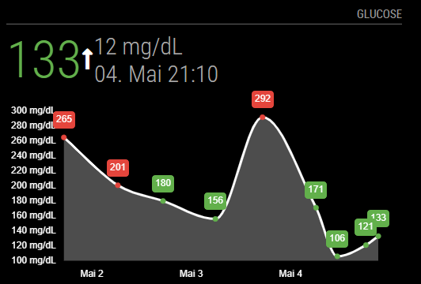
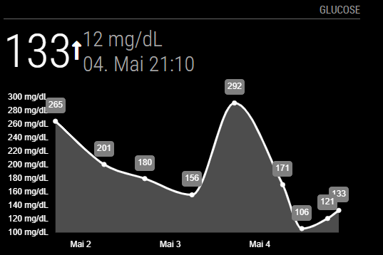

# Module: MMM-OneTouchReveal
The module allows you to monitor your Glucose Levels based on manual measurements with a compatible LifeScan OneTouch Device.
It supports every LifeScan OneTouch glucose meter that uses the [One Touch Reveal Cloud](http://onetouchreveal.com)



## Installation

In your terminal, go to your MagicMirror's Module folder:
````
cd ~/MagicMirror/modules
````

Clone this repository:
````
git clone https://github.com/canonip/MMM-OneTouchReveal
````

Configure the module in your `config.js` file.

## Using the module

To use this module, add it to the modules array in the `config/config.js` file:
````javascript
modules: [
  {
    module: "MMM-OneTouchReveal",
    config: { // See "Configuration options" for more information.
      username: "email@address.com",
      password: "password",
      colorEnabled: true,
    }
  }
]
````

## Configuration options

The following properties can be configured:

|Option|Default|Description|
|---|---|---|
|`username`|**Required**|Email Address|
|`password`|**Required**|Password|
|`url`|`"onetouchreveal.de"`|Endpoint URL. OneTouchReveal has different URLs for different countries **Without leading or ending slash**|
|`updateInterval`|`5 * 60 * 1000`|How often (in ms) to check for new data.|
|`lastDateFormat`|`"DD. MMM HH:mm"`|Date format used on "Last Measurement"|
|`chartDateFormat`|`"MMM D"`|Date format used on y-Axis in the graph|
|`width`|`"500px"`|Chart Width|
|`from`|`one week before today`|Start time of graph (in YYYYMMDD format)|
|`end`|`today`|End time of graph (in YYYYMMDD format)|
|`animationSpeed`|`1000`|Animation speed when data gets refreshed|
|`highGlucoseColor`|`"#f44336"`|Color in Chart when Glucose Levels are too high|
|`goodGlucoseColor`|`"#4caf50"`|Color in Chart when Glucose Levels are okay|
|`lowGlucoseColor`|`"#2196f3"`|Color in Chart when Glucose Levels are too low|
|`colorEnabled`|`false`|Whether colors will be used, or greyscale only. False overrides high/good/lowGlucoseColor!|
